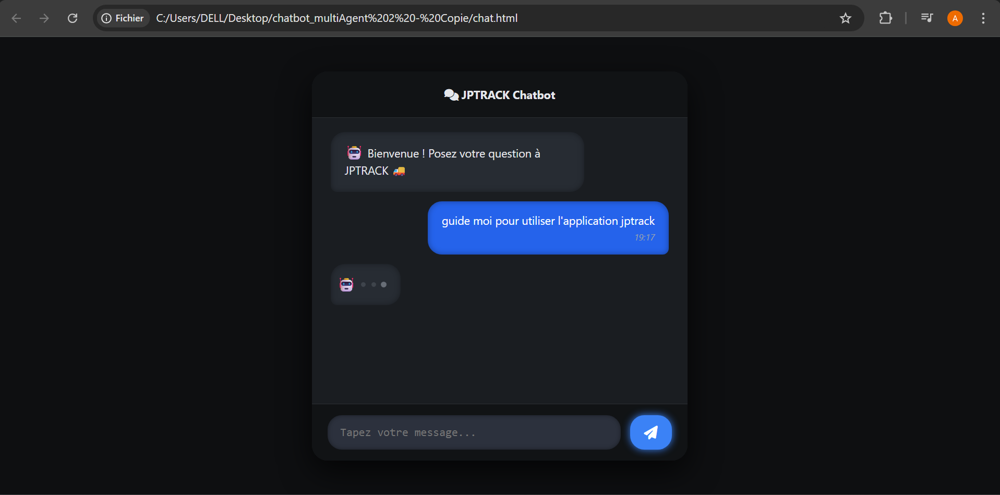
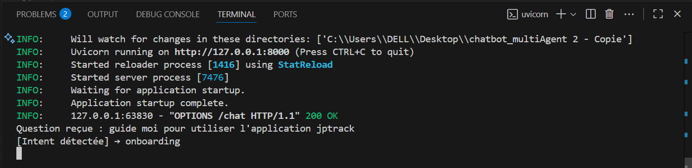
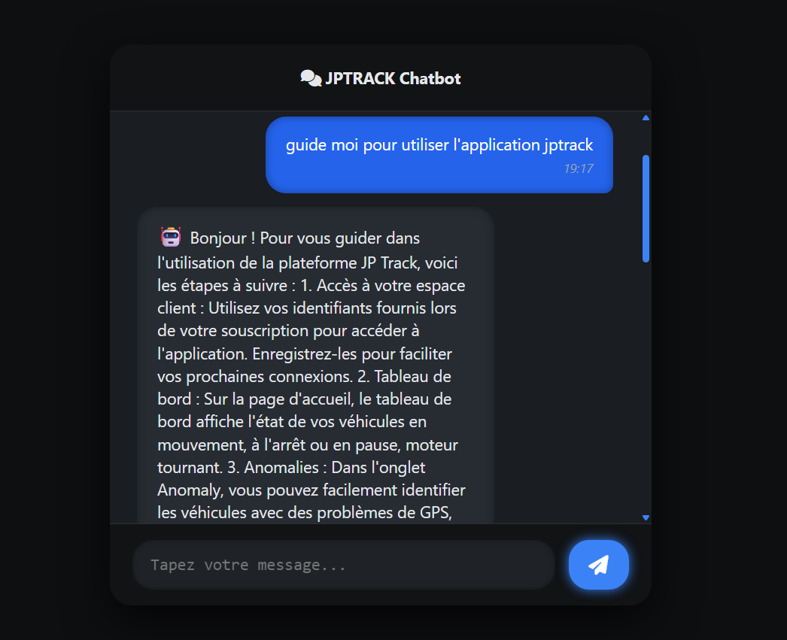

## **📘 Documentation – Chatbot Multi-Agent**
Voila l'interface :

Lorsque l’utilisateur pose une question:

1. 📩 La question reçue  
2. 🧠 L’intention détectée (exemple : `onboarding`)  
3. 🤖 L’agent correspondant sélectionné (ici **Onboarding Agent**)  
4. 📤 La réponse générée par cet agent, renvoyée à l’utilisateur  

Voici un exemple d’exécution dans le terminal :

et voila la réponse: 

1. _Cloner le projet_

`git clone git@gitlab.com:elhadjiatikapfa/chatbot_multi-agent.git`
`cd chatbot_multi-agent`

2. _Créer un environnement virtuel_

`python -m venv venv`

3. _Activer l'environnement_ 

`.\venv\Scripts\activate`

4. _Installer les dépendances_ 

`pip install -r requirements.txt`

#### Installation et configuration de Supabase (local)

1. _Installer la CLI supabase_

Télécharge et install CLI oficielle 
[Guide installation](https://supabase.com/docs/guides/local-development/cli/getting-started)

2. Crée un projet et initialiser supabase

`mkdir Chatbot`
`cd Chatbot`
`supabase start`

3. Accéder à Supabase Studio

`http://localhost:54323`

Ce lien ouvre Supabase Studio (interface web) où tu peux :

-- Créer des tables

-- Explorer tes données

-- Gérer tes policies (RLS)

4. Variables d'environnement

`supabase status`

SUPABASE_URL=http://localhost:54321

SUPABASE_ANON_KEY=...

SUPABASE_SERVICE_ROLE_KEY=...

➡️ Ces infos doivent être ajoutées dans le projet(agent/) pour se connecter à la base.

dans supabase studio il doit créer les tables (sales , tutoring, reclamation)

#### Installation et utilisation d'un llm local

👉 ollama est un outil qui permet de lancer llaMa local 
- Télécharge depuis https://ollama.ai
- installe-le

Télécharger un modéle (llaMA 3, mistral ...)

`ollama pull llama3` ou `ollama pull mistral`

#### Lancer le serveur

`uvicorn app:main --reload`

Le serveur démarre sur : http://127.0.0.1:8000

