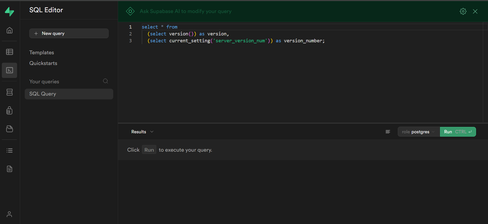

## **📘 Documentation – Chatbot Multi-Agent**
1. _Cloner le projet_

`git clone git@gitlab.com:elhadjiatikapfa/chatbot_multi-agent.git`
`cd chatbot_multi-agent`

2. _Créer un environnement virtuel_

`python -m venv venv`

3. _Activer l'environnement_ 

`.\venv\Scripts\activate`

4. _Installer les dépendances_ 

`pip install -r requirements.txt`

#### Installation et configuration de Supabase (local)

1. _Installer la CLI supabase_

Télécharge et install CLI oficielle 
[Guide installation](https://supabase.com/docs/guides/local-development/cli/getting-started)

2. Crée un projet et initialiser supabase

`mkdir Chatbot`
`cd Chatbot`
`supabase start`

3. Accéder à Supabase Studio

`http://localhost:54323`

Ce lien ouvre Supabase Studio (interface web) où tu peux :

-- Créer des tables

-- Explorer tes données

-- Gérer tes policies (RLS)

